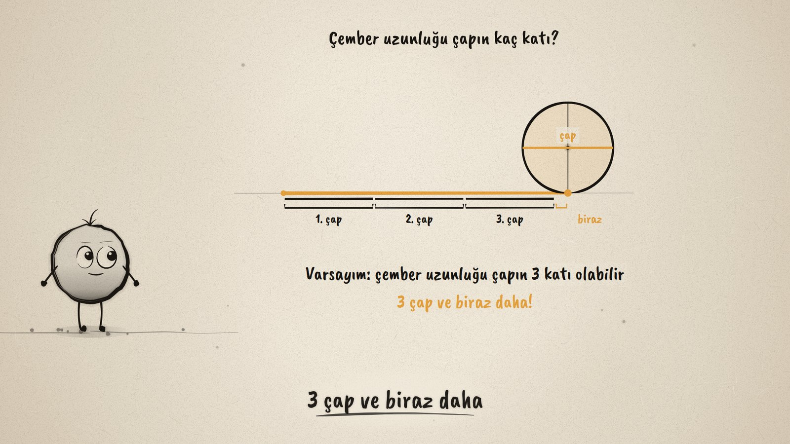
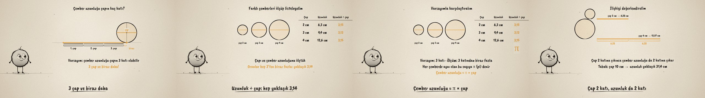

# Çemberi Aç · Circumference and Diameter

**▶ Tarayıcıda izleyin / Watch in the browser:** https://hakanatas.github.io/cemberi-ac/ 
**⬇ MP4 + altyazılar / MP4 + subtitles:** [Releases](https://github.com/hakanatas/cemberi-ac/releases) 
**✎ Kullanılan istem / The prompt behind it:** [PROMPT.md](PROMPT.md) 
**🎞 Bütün filmler / All films:** [Nokta'nın Filmleri](https://hakanatas.github.io/nokta-filmleri/?sinif=6)

> **TR —** 6. sınıf matematik "Geometrik Nicelikler" temasındaki MAT.6.4.4 öğrenme çıktısı için hazırlanmış, tamamen JavaScript ile çizilen 92 saniyelik mürekkep animasyonu. Çapı 4 cm olan bir tekerlek tam bir tur dönüyor ve yerde çemberin uzunluğu kadar iz bırakıyor. Varsayım: çember uzunluğu çapın 3 katı olabilir. Çap iz üzerine art arda konunca 3 çap sığıyor ve biraz daha kalıyor. Çapı 2, 3 ve 4 cm olan üç çember ölçülüp bir tabloya listeleniyor: uzunluk ÷ çap her seferinde yaklaşık 3,14. Varsayımla karşılaştırılıyor (3 katından biraz fazla) ve bu sabit sayıya π deniyor; önerme: çember uzunluğu = π × çap = 2 × π × yarıçap. Son olarak ilişki değerlendiriliyor: çap 2 katına çıkınca çember uzunluğu da 2 katına çıkıyor, π 3 ile 4 arasında ve 3'e çok yakın. Altyazılar Türkçe, İngilizce ya da ikisi birlikte seçilebilir.

A 92-second ink animation for **6th-grade maths**, the fourth film of the fourth 6th-grade theme. Nokta, the ink character from [The Learning Ink](https://github.com/hakanatas/the-learning-ink), is the guide again. The wheel really rolls: its centre moves by the radius times the angle it has turned (`roll` in `src/draw/film.js`), so the amber trace it leaves is exactly its circumference, and the three diameters laid on it fall short by the true 0.14.

## Learning outcome

MEB, Türkiye Yüzyılı Maarif Modeli, Ortaokul Matematik, 6th grade, "Geometrik Nicelikler" theme:

**MAT.6.4.4. Çemberin uzunluğu ile çap uzunluğu arasındaki ilişkiye yönelik çıkarım yapabilme**
- a) Çemberin uzunluğu ile çap uzunluğu arasındaki ilişkiye yönelik varsayımlarda bulunur.
- b) Çemberlerin uzunlukları ile çap uzunlukları arasındaki ilişkileri listeler.
- c) Çemberin uzunluğu ile çap uzunluğu arasındaki ilişkiyi varsayımlarıyla karşılaştırır.
- ç) Çemberin uzunluğu ile çap uzunluğu arasındaki ilişkiye yönelik önermeler sunar.
- d) Elde ettiği ilişkiye yönelik değerlendirmeler yapar.

## Scenes

| # | Time | Scene | What happens | Outcome |
|---|---|---|---|---|
| 1 | 0–10 s | Tekerlek | A wheel rolls one turn and leaves its circumference on the ground. | a |
| 2 | 10–28 s | Varsayım | "Three times the diameter?" Three diameters fit, with a little left over. | a |
| 3 | 28–46 s | Ölç ve listele | Circles of diameter 2, 3 and 4 cm in a table; length ÷ diameter is about 3.14 each time. | b |
| 4 | 46–64 s | Karşılaştır ve öner | A little more than 3; the constant is π; circumference = π × diameter = 2 × π × radius. | c, ç |
| 5 | 64–80 s | Değerlendir | Double the diameter, double the length; a 10 cm plate; π is between 3 and 4. | d |
| 6 | 80–92 s | Aklında kalsın | The same ratio in every circle: π. | ç, d |

## Running it

- **Preview:** double-click `index.html` (it works offline).
- **MP4:** run `npm install` once, then `npm run export -- --format=horizontal --captions=tr`.
- **Subtitles and narration:** `npm run srt` writes `out/captions_*.srt` and `narration_notes.txt`.
- **Editing:**
  - Caption text, timings and narration notes: `captions.js`
  - Everything on screen is drawn by `LI.world(t)` in `scenes/scene1.js` (the rolling wheel, the table, the doubled bars, the words); the other scenes only set the camera.
  - Circles, the rolling wheel, brackets and Nokta's poses: `src/draw/film.js`; layout for 16:9 and 9:16: `src/draw/kd.js`

It uses the same engine as The Learning Ink: `renderFrame(t)` as a pure function of time, seeded randomness, and frame-by-frame export.
